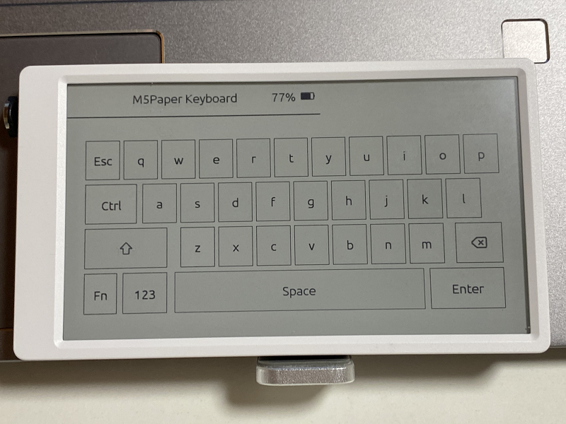
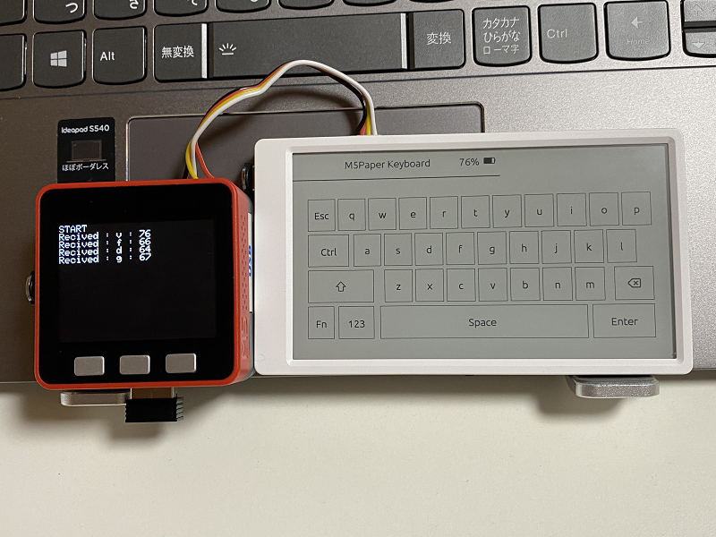
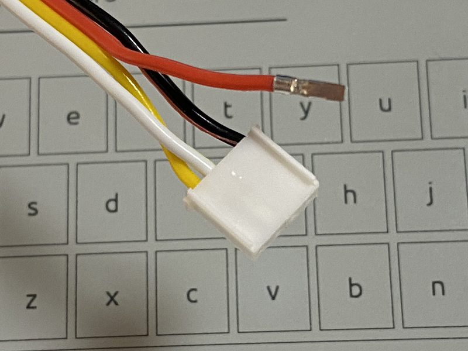
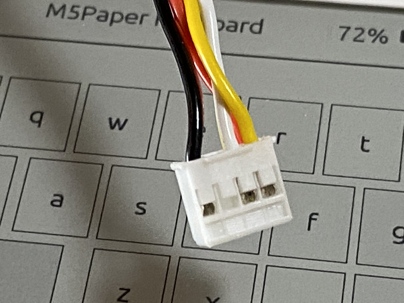
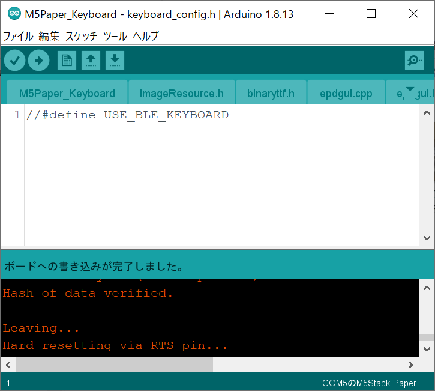

# M5Paper_Keyboard
M5Paper_Keyboard is a serial keyboard that runs on M5Paper.
It also supports BLE keyboard.

  

### What you need ###
- M5Paper
- Arduino IDE (I checked the operation with 1.8.13.)
-Arduino core for the ESP32
- M5Paper Library
- NimBLE-Arduino Library (when used as a BLE keyboard)
- ESP32 NimBLE Keyboard library (when used as a BLE keyboard)

The library is easy to install from the Arduino IDE's Sketch | Include Libraries | Manage Libraries

### Serial port specifications ###
Use PORT C of M5 Paper. The settings are as follows.
// Serial2.begin (unsigned long baud, uint32_t config, int8_t rxPin, int8_t txPin, bool invert)
Serial2.begin (115200, SERIAL_8N1, 19, 18);

### Supplemental info ###
To turn off the power, use the "BATTERY OFF" button on the back of the M5 Paper.
The "Fn" key is unused, so please use it for function expansion.

---
The M5Stack program (M5Stack_Serial2_test) for checking the operation of M5Paper_Keyboard is prepared. 

  

### What you need ###
- M5Stack (I checked the operation with Fire.)
- Arduino IDE (I checked the operation with 1.8.13.)
- Arduino core for the ESP32
- M5Stack Library
- LovyanGFX library

The library is easy to install from the Arduino IDE's Sketch | Include Libraries | Manage Libraries ....

### Serial port specifications ###
- Use PORT C of M5Stack. The settings are as follows.
// Serial2.begin (unsigned long baud, uint32_t config, int8_t rxPin, int8_t txPin, bool invert)
Serial2.begin (115200, SERIAL_8N1, 16, 17);

Note: PSRAM must be disabled when using M5Stack Fire there is.

---

### How to make a cross cable ###
A crossover cable is required to connect M5Stack and M5Paper_Keyboard with M5StackSerial2_test.
Unplug the red cable (power supply) and cross the white and yellow cables.

How to make a cross cable
A crossover cable is required to connect M5Stack and M5Paper_Keyboard with M5StackSerial2_test.
Unplug the red cable (power supply) and cross the white and yellow cables.

---

### When using as a BLE keyboard ###
Uncomment "#define USE_BLE_KEYBOARD" in "keyboard_config.h" and build.

  
- Pair with "M5 Paper-Keyboard".
- How to switch between half-width and full-width (confirmed)
  iPhone11 (iOS14): [Ctrl] + [Space]
  Android (FIRE HD 8): [Shift] + [Space]
  Windows 10: [Alt] + [`]
